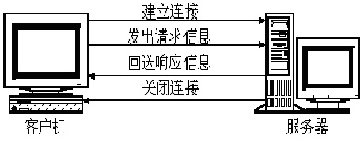
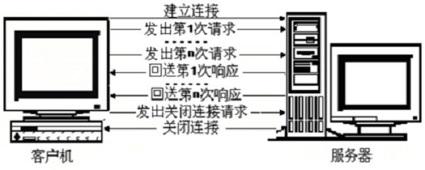
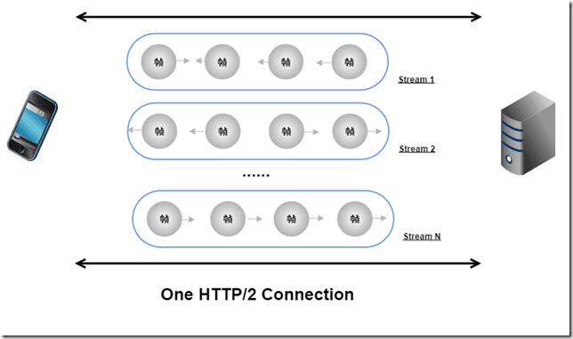
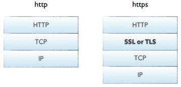
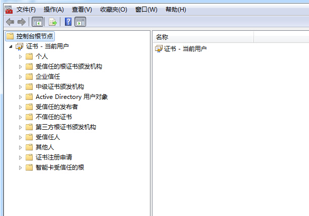

### HTTP 0.9

服务器只能响应 html 格式字符串

### HTTP 1.0

+ 浏览器与 WEB 服务器的连接过程是短暂的，对每一个资源的访问 浏览器与 WEB 服务器都要建立一次单独的 TCP 连接

+ 浏览器到 WEB 服务器之间的所有通讯都是完全独立分开的请求和响应对

+ 支持长连接 需要手动设置 Connection: keep-alive 否则会使用短暂链接

### HTTP/1.1

+ 增加了更多的请求头和响应头

+ 引入了持久连接

	TCP 连接默认不关闭 ( 默认 Connection: keep-alive ) 直到一段时间后自动关闭或者发送 Connection: close 手动关闭
    
    对于同一个域名 大多数浏览器允许同时建立 6 个左右持久连接
    
+ 请求流水线 (Pipelining)

	HTTP Pipelining 其实是把多个 HTTP 请求放到一个 TCP 连接中一一发送，而且在发送过程中不需要等待前一个请求的响应就可以发出下一次请求
    
    只不过 HTTP1.1 中服务器还是要按照发送请求的次序来处理请求，客户端也还是要按照发送请求的顺序来接收响应 这就造成了线头阻塞 ( Head-of-line blocking )

    
### HTTP 2.0

主要解决了线头阻塞问题

+ 请求优先级

+ 服务端推送

+ 二进制分帧

	* 帧 所有HTTP 2. 0 通信都在一个TCP连接上完成

		HTTP 2.0 通信的基本单位
        
        每个帧有一个头部信息 其中包含帧的长度和类型、一些布尔标志、一个保留位和一个流标识符
        
    * 消息

		消息是一组帧 表示 HTTP 请求或响应
        
        特定消息的帧在同一个流上发送
        
    * 流

		流是连接中的一个虚拟信道 可以承载双向消息传输
    
+ 多路复用 (Multiplexing)

    

### HTTPS

+ 发展

1. 对称加密（速度快）

（持有秘钥）客户端  ----------秘钥加密的数据--------->  服务器（持有秘钥）

（持有秘钥）客户端  <----------秘钥加密的数据---------  服务器（持有秘钥）

秘钥是一方发给另一方的，这种模式下双发维护秘钥的过程有点复杂，中间可能存在被劫持风险。

2. 非对称加密（速度慢）

（持有公钥）客户端  ----------公钥加密的数据--------->  服务器（持有私钥）

（持有公钥）客户端  <----------私钥加密的数据---------  服务器（持有私钥）

由于公钥是公开的，黑客也可以获取公钥，劫持服务端回传的数据。

3. 公私钥结合

（持有公钥和对称秘钥）客户端  --------------------hello 信息-------------------->  服务器 （持有私钥）

（持有公钥和对称秘钥）客户端  <--------------------hello 信息--------------------  服务器 （持有私钥）

（持有公钥和对称秘钥）客户端  -------公钥加密 将对称秘钥发往服务端，只有私钥可解密----->  服务器 （持有私钥 + 对称秘钥）

（持有公钥和对称秘钥）客户端  <----------------对称加密交换数据-------------------  服务器 （持有私钥 + 对称秘钥）

4. 公钥从哪里来的

（==对称秘钥==）客户端  --------------------hello 信息-------------------->  服务器 （==持有私钥及SSL证书==）

（==持有公钥和对称秘钥==）客户端  <---------------==SSL证书发给客户端==------------------  服务器 （==持有私钥及SSL证书==）

（==持有公钥和对称秘钥==）客户端  -------公钥加密 将对称秘钥发往服务端，只有私钥可解密----->  服务器 （==持有私钥及SSL证书及对称秘钥==）

（==持有公钥和对称秘钥==）客户端  <----------------对称加密交换数据-------------------  服务器 （==持有私钥及SSL证书及对称秘钥==）

5. SSL 证书的验证

操作系统负责验证证书的真假

    
    
    
    